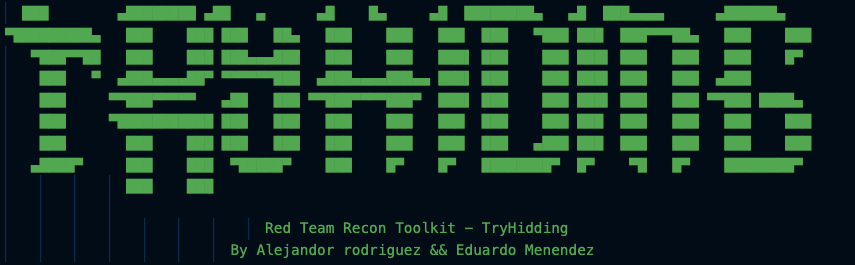

                       


is a powerful and stylish terminal-based reconnaissance toolkit created for Red Team engagements, audits, and CTFs.  
It was developed by **Alejandro Rodriguez** and **Eduardo Menendez** to automate common recon tasks with colorful output and clean structure.

---

## ✨ Features

- 🌐 DNS resolution
- 🔍 WHOIS information via subprocess
- 🕵️ Subdomain enumeration using crt.sh
- 📦 GitHub leak detection with optional Personal Access Token (PAT)
- 📜 Historical URLs using the Wayback Machine
- 🔎 Google Dork generation for fast OSINT
- 💾 Saves all results to `recon_log.txt`
- ⌨️ Clean exit on `Ctrl+C`

---

## 📦 Requirements

- Python 3.8+
- Install dependencies:

```bash
pip install -r requirements.txt
